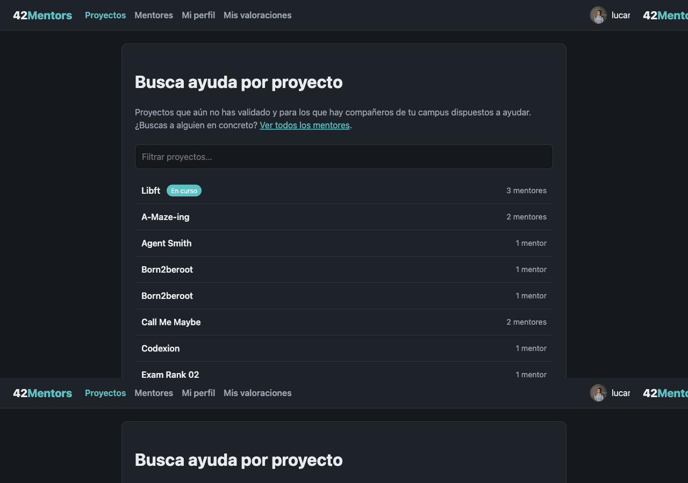
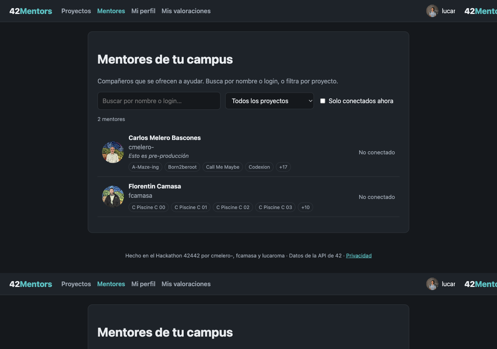
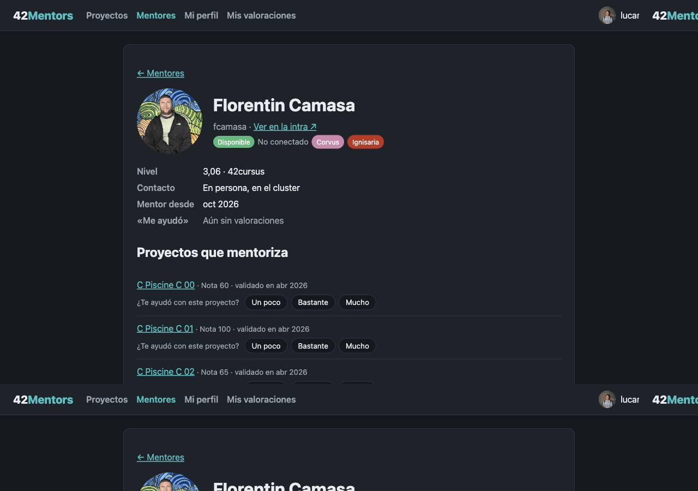
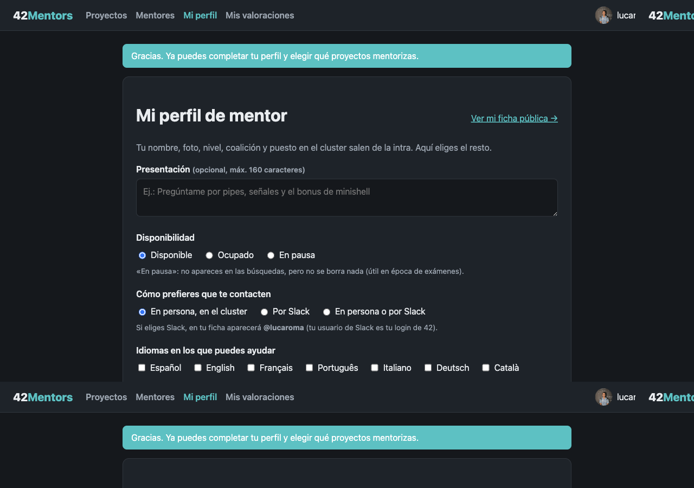
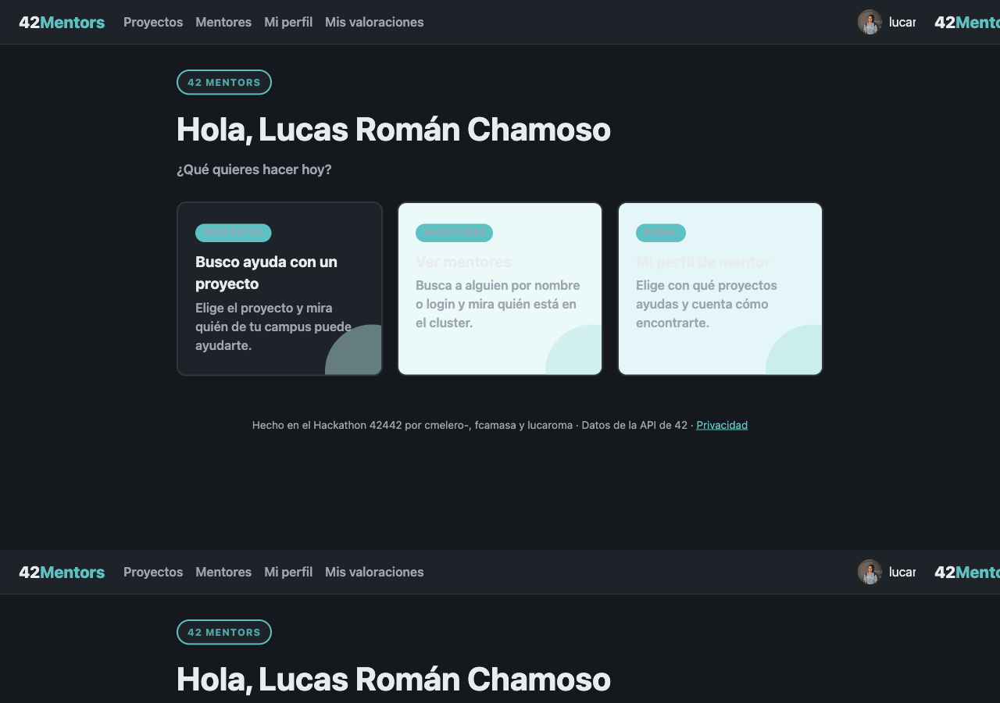

# 42 Mentors

Web para que los estudiantes de 42 encuentren compañeros que ya han validado el proyecto en el que están atascados, y para que quienes ya lo terminaron se ofrezcan a ayudar.

**A quién ayudamos:**
- al **estudiante atascado** en un proyecto, que no sabe quién de su campus lo ha validado y quiere ayudar;
- al **estudiante que ya lo validó** y quiere echar una mano, que no tiene dónde decirlo, más allá de un mensaje en Slack que se pierde.

Proyecto del **Hackathon 42442** (42 Madrid, octubre de 2026), equipo **42mentors**. Desplegado en **https://42.2275676.xyz**. Por las condiciones de uso de la API de 42, todo el contenido está detrás del login con 42.

## Equipo

| Login 42 | GitHub | Nombre | Responsabilidades |
|---|---|---|---|
| `cmelero-` | [`Carlos-mb`](https://github.com/Carlos-mb) | Carlos | Coordinación del proyecto y del equipo; MVP (login, perfiles, proyectos, directorio y ficha); caché de perfiles; «Me ayudó»; despliegue en el servidor y paso a producción |
| `fcamasa` | [`Floren87`](https://github.com/Floren87) | Florentin | Metodología de ideación; CI (sintaxis PHP y búsqueda de secretos); ocultar los proyectos de la piscina; textos de privacidad de la caché; pruebas; problemas técnicos del README |
| `lucaroma` | [`lucas-rcv`](https://github.com/lucas-rcv) | Lucas | Gestión del proyecto en el README; ocultar mentores inactivos; interfaz (UI) |

Algunos commits aparecen con otro nombre de autor en git (`ThisWeekapp` es Lucas y `Florentin Vasilica Camasa` es Florentin), pero GitHub los asocia a la cuenta correcta.

### Aportaciones de cada integrante
Cada tarea tiene su issue, su rama y su Pull Request a `develop`, revisada y probada por otro miembro.

- **Carlos (`cmelero-`):**
  - MVP inicial: login con 42, Mi perfil, Proyectos, directorio de Mentores y ficha del mentor;
  - caché de perfiles para no superar el límite de la API ([#2](https://github.com/Carlos-mb/42mentors/pull/2));
  - «Me ayudó», con votos de 1 a 3 y «Mis valoraciones» ([#34](https://github.com/Carlos-mb/42mentors/pull/34));
  - guía de ramas y PR para el equipo y normas para las IA ([#1](https://github.com/Carlos-mb/42mentors/pull/1), [#23](https://github.com/Carlos-mb/42mentors/pull/23), [#24](https://github.com/Carlos-mb/42mentors/pull/24), [#37](https://github.com/Carlos-mb/42mentors/pull/37), [#39](https://github.com/Carlos-mb/42mentors/pull/39));
  - revisión de PR, pruebas en el servidor y despliegues.
- **Florentin (`fcamasa`):**
  - metodología de ideación y prototipado ([#27](https://github.com/Carlos-mb/42mentors/pull/27));
  - CI con GitHub Actions ([#31](https://github.com/Carlos-mb/42mentors/pull/31));
  - ocultar los proyectos de la piscina ([#41](https://github.com/Carlos-mb/42mentors/pull/41));
  - textos de privacidad de la caché ([#42](https://github.com/Carlos-mb/42mentors/pull/42));
  - problemas técnicos del entorno local ([#40](https://github.com/Carlos-mb/42mentors/pull/40));
  - pruebas de login, consentimiento, perfil y directorio, y revisión de PR, incluida la prueba de «Me ayudó» en el servidor.
- **Lucas (`lucaroma`):**
  - gestión del proyecto en el README ([#29](https://github.com/Carlos-mb/42mentors/pull/29));
  - ocultar a los mentores inactivos ([#43](https://github.com/Carlos-mb/42mentors/pull/43));
  - interfaz nueva: tarjetas, barra fija, paleta de 42 Madrid y lectura en móvil ([#44](https://github.com/Carlos-mb/42mentors/pull/44), [#45](https://github.com/Carlos-mb/42mentors/pull/45));
  - prueba de «Me ayudó» en el servidor.

## El problema ("dolor")

La lista de proyectos de 42 es cada vez más larga y compleja. Cuando un estudiante se atasca en un proyecto que nadie de su entorno conoce, no tiene una forma rápida de saber **quién de su campus ya lo ha validado** y está dispuesto a ayudar. La información existe en la intra, pero está dispersa y no indica quién quiere ayudar.

## La solución

1. **Login con 42:** OAuth2 de la API de 42, sin registro aparte.
2. **Mi perfil (mentor):**
   - marca con qué proyectos validados puede ayudar, con una nota opcional por proyecto. No se ofrecen los de la piscina, que ya no se hacen después de ella;
   - escribe una presentación;
   - indica su disponibilidad (*Disponible*, *Ocupado* o *En pausa*, que le oculta de las búsquedas);
   - indica cómo prefiere que le contacten (en el cluster o por Slack) y en qué idiomas.
3. **Proyectos (estudiante):** los proyectos que aún no ha validado y que tienen mentores en su campus, con los que tiene en curso primero. Al pulsar uno, ve los mentores con foto, nota sobre el proyecto y **puesto en el cluster si están conectados**.
4. **Mentores:** directorio del campus con buscador por nombre o login (sin importar las tildes), filtro por proyecto y filtro «conectados ahora».
5. **Ficha del mentor:**
   - datos de la intra: foto, nivel, coalición, puesto actual y nota y fecha de validación de cada proyecto que mentoriza;
   - lo que escribe el mentor: presentación, contacto, idiomas y notas;
   - «mentor desde» y enlace a su perfil de la intra;
   - los puntos «Me ayudó» que ha recibido, en total y por proyecto.

   El propio mentor ve además un botón para editarla.
6. **«Me ayudó»:** desde la ficha del mentor, el estudiante valora cuánto le ayudó con cada proyecto: «Un poco» (1 punto), «Bastante» (2) o «Mucho» (3). Los votos son **anónimos**: el mentor y los demás solo ven los totales. En **Mis valoraciones**, cada estudiante ve y cambia los suyos. Nadie puede votarse a sí mismo, y solo se vota a mentores del propio campus.
7. **Listas siempre útiles:** no salen los mentores «en pausa» ni los que llevan **más de 30 días sin entrar**. Siempre aparecen primero los conectados, luego los disponibles y después los ocupados.

### Uso de la API de 42
| Para qué | Endpoint |
|---|---|
| Login | `/oauth/authorize` + `/oauth/token` (Authorization Code flow) |
| Datos del usuario, campus, cursus y proyectos (una sola llamada al entrar; los cursus sirven para reconocer los proyectos de la piscina) | `GET /v2/me` |
| Nombre y foto de los mentores en las listas (una llamada por cada 100 mentores) | `GET /v2/users?filter[id]=…` |
| Ficha del mentor: puesto, nivel y notas de sus proyectos | `GET /v2/users/:id` |
| Ficha del mentor: coalición | `GET /v2/users/:id/coalitions` |
| Quién está conectado y dónde (una llamada por campus, cacheada 2 min) | `GET /v2/campus/:id/locations?filter[active]=true` |

Límite de la API: 2 peticiones por segundo y 1200 por hora por app. Por eso se usa caché y se reintenta ante un 429.

### Privacidad (condiciones de uso de la API de 42)
- Solo se guarda el mínimo, y **solo tras el consentimiento explícito** de quien se ofrece como mentor o de quien vota:
  - id, login, campus y proyectos que mentoriza;
  - lo que el propio mentor escribe en su perfil;
  - las valoraciones «Me ayudó»: quién vota a quién, por qué proyecto, cuántos puntos y cuándo. Fuera de «Mis valoraciones», solo se muestran totales.
- El nombre, la foto, el nivel, la coalición, las notas de la intra y la ubicación se consultan a la API. Para no superar su límite, se guardan en una caché temporal del servidor, que se renueva como mucho cada hora y se borra al borrar los datos. El token de acceso vive solo en la sesión.
- Quien solo vota no aparece en ningún sitio: no tiene ficha ni sale en las listas.
- Toda la información está detrás del login con 42, con `noindex` y `robots.txt`.
- Página de privacidad con botón **"Borrar mis datos"**, que borra también las valoraciones hechas y recibidas.

## Así se ve

Capturas de https://42.2275676.xyz con cuentas del equipo (`cmelero-`, `fcamasa`, `lucaroma`). No aparecen nombres, logins ni fotos de otros alumnos.

**Proyectos** — los que aún no has validado y que tienen mentores en tu campus:



**Mentores** — directorio del campus (en la captura, solo Carlos y Florentin):



**Ficha del mentor** — ejemplo con `fcamasa`:



**Mi perfil** — dónde el mentor elige disponibilidad, contacto, idiomas y proyectos:



Inicio, con sesión iniciada:



## Metodología de ideación y prototipado

### Cómo surgió la idea
La idea nació de juntar tres necesidades reales de los miembros del equipo:

- **Florentin** quería conectar a las personas de la comunidad de 42 y hacerla crecer. Además, tenía una necesidad concreta: buscar apoyo para el examen 02 del common core, que lleva más de 10 intentos.
- **Carlos** necesitaba encontrar compañeros para sus proyectos. En su experiencia, Slack no es un canal productivo para eso: los mensajes se pierden y no se sabe quién está dispuesto a ayudar.
- **Lucas** propuso animar a la gente a participar en la comunidad con algún incentivo, de forma que ayudar sirva también para conocer a otros estudiantes.

Al ponerlas en común vimos que las tres tenían una raíz común: **la ayuda existe en el campus, pero no hay forma de encontrarla**. De ahí salió la idea: una web donde quien ya ha validado un proyecto puede ofrecerse a ayudar con él, y quien está atascado puede ver quién se ha ofrecido y dónde está sentado en ese momento.

### Alternativas descartadas
| Alternativa | Por qué se descartó |
|---|---|
| Premios o recompensas por participar (idea de Lucas) | Requiere implicar al staff de 42 y no cabía en el plazo del hackathon. Se deja como evolución futura; como primer paso se planteó el botón «Me ayudó» y un ranking de mentores. |
| Seguir usando Slack | Es el problema de partida: los mensajes se pierden y no indican quién ha validado el proyecto ni quién quiere ayudar. |
| Flask (Python) | El hosting compartido no admite Python. Se cambió a PHP sin framework con MySQL. |
| Mostrar los proyectos a los que el estudiante puede inscribirse (`/projects_users/registration`) | Se priorizaron los proyectos no validados que **ya tienen mentores**, porque un proyecto sin mentores no le sirve al estudiante. Queda como mejora. |

### Prototipado
1. **Análisis (1-2 oct):** lectura del enunciado, las bases y las condiciones de uso de la API de 42, que marcaron el diseño de privacidad (consentimiento, datos mínimos, borrado).
2. **MVP desplegado el 2 oct** en el dominio del proyecto: login con 42, «Mi perfil» para marcar proyectos y búsqueda de mentores por proyecto.
3. **Iteración sobre el MVP (2-3 oct):** directorio de mentores con buscador, ficha del mentor con datos de la intra, y caché para no superar el límite de la API.
4. **Mejoras sobre el MVP (4-5 oct):**
   - «Me ayudó», como primer paso hacia los incentivos que proponía Lucas;
   - ocultar los proyectos de la piscina, porque después de la piscina no tiene sentido mentorizarlos;
   - ocultar a los mentores que llevan tiempo sin entrar, para que las listas muestren a gente que de verdad puede ayudar;
   - interfaz nueva, más clara en el móvil.
5. **Cierre (5 oct, 14:00):** desarrollo cerrado. Lo que no estaba terminado pasó a [Mejoras futuras](#mejoras-futuras).

### Validación
Antes de desarrollarla, contamos la idea a **más de 20 estudiantes de 42 Madrid**, y a todos les pareció muy buena idea. Confirmaron lo que habíamos visto en el equipo: cuando alguien se atasca en un proyecto, no tiene una forma rápida de saber quién del campus lo ha validado y quiere ayudar.

## Gestión del proyecto

Nos organizamos en [issues de GitHub](https://github.com/Carlos-mb/42mentors/issues). Esa lista es el tablero: cada tarea tiene un responsable (*assignee*), etiquetas (`prioridad alta`, `en curso`, `bloqueada` y el tipo) y un «Terminado cuando». Las issues sin asignar puede cogerlas cualquiera.

**Quién decide.** Carlos (`Carlos-mb`) coordina el proyecto: aprueba asignaciones y cambios de criterio. Para proponer uno se comenta en la issue mencionando a `@Carlos-mb`.

**Cómo se reparte el día a día.** La IA de cada miembro hace de coordinadora personal (reglas en [AGENTS.md](AGENTS.md)): mira las PR por revisar, las issues asignadas y recomienda la siguiente tarea. El avance se deja en un comentario de la issue al parar, para que otro pueda retomarla.

**Reuniones.** Daily corta cuando hace falta (el 3 de octubre repasamos issues y cómo se aprueban las PR). El resto del tiempo la coordinación es por las issues, para que las tres IA vean lo mismo.

**Ramas y Pull Requests.**
- `main`: lo publicado en https://42.2275676.xyz
- `develop`: donde se juntan las tareas terminadas
- Una rama por tarea, siempre desde `develop` (`feature/<n>-…`, `fix/<n>-…`, `docs/<n>-…`), y vuelve a `develop` con una Pull Request
- Otro miembro revisa y prueba antes de aprobar. Nadie hace commit directo en `main` ni `develop`, ni fusiona su propia PR
- La PR menciona su issue (`Issue: #<n>`). Cuando la PR se fusiona en `develop`, la issue se cierra a mano con un comentario que enlaza la PR (`Closes #<n>` solo funciona en PR a `main`, la rama por defecto)
- Commits: [Conventional Commits](https://www.conventionalcommits.org/es/) (`feat:`, `fix:`, `docs:`…)

**Tablero.** Las issues son la fuente de verdad. Vista del equipo: https://github.com/Carlos-mb/42mentors/issues. Un tablero visual de GitHub Projects es opcional y no sustituye a las issues.

**Calidad.**
- Cada PR pasa la CI de GitHub Actions: sintaxis PHP con `php -l` y búsqueda de secretos con gitleaks.
- Antes de aprobarla, otro miembro la prueba en el servidor, con backup previo de la carpeta y de la base de datos.
- Cuando varias PR estaban listas a la vez, se probaron juntas en un paquete integrado.

**Plazos.** Hay dos hitos en GitHub: «Cierre de desarrollos (5 oct, 14:00)» y «Code freeze (6 oct, 18:00)».
- Pasado el cierre de desarrollos, solo se hizo documentación, el pitch y el paso a `main`. El calendario está en la issue [#38](https://github.com/Carlos-mb/42mentors/issues/38).
- Lo que no llegó al cierre se anotó en [Mejoras futuras](#mejoras-futuras).

### Uso de IA
Usamos asistentes de IA (Claude Code, entre otros) para programar, redactar documentación y trabajar con git.
- **Lo decide el equipo:** qué se construye, el diseño de cada funcionalidad, el reparto de tareas y qué se fusiona.
- **Lo hace la IA:** propone y escribe código y textos, y ejecuta comandos de git siguiendo las reglas de [AGENTS.md](AGENTS.md). Entre esas reglas: no subir secretos, no tocar `main` ni `develop` directamente y no fusionar PR.
- **Cómo se controla:** cada cambio va en su rama y con su Pull Request, y otro miembro lo revisa y lo prueba antes de aprobarlo. Los commits en los que ha participado la IA lo indican con `Co-Authored-By`.

## Registro de horas

| Fecha | cmelero- | fcamasa | lucaroma | Qué se hizo |
|---|---|---|---|---|
| 2026-10-01 | | | | Formación de equipos |
| 2026-10-02 | 4 | 1 | 1 | Análisis, documentación de la API, verificación del hosting, MVP inicial. lucaroma: reunión de equipo y lectura del enunciado |
| 2026-10-03 | 1 | 3 | 1 | fcamasa: app de la API creada desde mi perfil de la intra y entorno de desarrollo preparado en localhost; por la tarde, revisión de la PR #2, issue #25 y apartado de ideación del README. cmelero- (con fcamasa): configuración de la IA como coordinadora mediante issues de GitHub; repaso de cómo es una issue y de cómo se aprueban y fusionan las PR. lucaroma: reunión de coordinación (issues y PRs) |
| 2026-10-04 | 1 | 2 | | cmelero-: revisión y aprobación de las PR del equipo (CI, ideación, gestión y horas); asignación de la UI a lucaroma; botón «Me ayudó» con votos de 1 a 3 y página «Mis valoraciones» (PR #34). fcamasa: CI con GitHub Actions (#21), pruebas de login, consentimiento y perfil (#14, #15) e issue de mejora #33 |
| 2026-10-05 | 3 | | 3 | cmelero-: revisión, prueba en el servidor y fusión de las PR del día (piscina, texto de la caché, «Me ayudó», inactivos e interfaz); PR de paso a `main` (#49); reglas de entrega según el correo de la organización, respuesta al correo y README frente a los requisitos mínimos. lucaroma: interfaz (paleta, sombras, colores oficiales de 42 y arreglo de las tarjetas) y pruebas de «Me ayudó» en el servidor (#34, #45) |
| 2026-10-06 | | | 1 | lucaroma: revisión de las PR de entrega (#55, #54, #49) y horas del 5 y del 6 en el README |
| **Total** | 9 | 6 | 6 | |

## Cómo levantar el proyecto

### Requisitos
- PHP 8.1 o superior con las extensiones `curl` y `pdo_mysql`.
- MySQL o MariaDB.
- Una aplicación OAuth en la intra: https://profile.intra.42.fr/oauth/applications/new, con tipo *42 Community Development*, scope `public` y la Redirect URI apuntando a `callback.php`.

### Pasos
1. Crear una base de datos y ejecutar [`sql/schema.sql`](sql/schema.sql), por ejemplo desde phpMyAdmin. Si la base de datos ya existe de una versión anterior, aplicar en orden los ficheros de [`sql/migrations/`](sql/migrations/).
2. Copiar [`.env.example`](.env.example) como `.env` y rellenarlo con las credenciales de la app OAuth y de la base de datos.
3. Hacer que el servidor web sirva **solo la carpeta `public/`**. `src/`, `sql/`, `cache/` y `.env` deben quedar fuera de la parte pública.
4. Comprobar que `cache/` tiene permisos de escritura para PHP.
5. Abrir la web y entrar con 42. Para ofrecerse como mentor se va a «Mi perfil», que pide el consentimiento la primera vez. Para probar «Me ayudó» hacen falta dos cuentas, porque nadie puede votarse a sí mismo.

Para desarrollo en local con XAMPP, despliegue en el hosting y flujo de git, ver [INSTRUCCIONES_EQUIPO.md](INSTRUCCIONES_EQUIPO.md).

### Estructura
```
public/          Lo único accesible por web (páginas, CSS, JS, robots.txt)
src/             Lógica: configuración, BD, cliente de la API, sesión, cachés, votos, vistas
sql/schema.sql   Esquema completo de la base de datos (instalaciones nuevas)
sql/migrations/  Cambios para bases de datos ya creadas (001–003)
cache/           Caché temporal de ubicaciones y perfiles de mentores (no se versiona)
tools/           Script que genera el paquete de despliegue (sin secretos)
.github/         CI: sintaxis PHP y búsqueda de secretos en cada PR
.env.example     Plantilla de configuración (el .env real nunca se sube)
```

## Problemas técnicos y soluciones

| Problema | Solución |
|---|---|
| La documentación de la API (`/apidoc`) requiere login y se anunció su retirada. | Se descargó entera para uso interno del equipo. No se publica porque es material de 42 con datos de ejemplo de personas. |
| El hosting compartido no admite Python. | Se eligió PHP sin framework con MySQL. |
| Duda de si el hosting permitía peticiones HTTPS salientes, imprescindibles para el OAuth. | Prueba con `curl` hacia `api.intra.42.fr`: respondió 401, así que la conexión funciona. |
| Límite de 1200 peticiones por hora. | Una sola llamada a `/v2/me` al entrar. Ubicaciones pedidas una vez por campus y cacheadas. Perfiles de mentores en una sola llamada. |
| Las condiciones de la API exigen consentimiento y datos mínimos. | Pantalla de consentimiento, esquema mínimo, borrado de datos y `noindex`. |
| En el PC de desarrollo (Linux) no había PHP ni MySQL. | Se instalaron `php-cli`, `php-curl`, `php-mysql` y `mariadb-server` con `apt`, y se arranca la web con el servidor integrado de PHP: `php -S localhost:8000 -t public`. No hace falta XAMPP. |
| Al crear la base de datos local salió `ERROR 1007: Can't create database 'mentors42'; database exists`. | El comando se había ejecutado dos veces. Se comprobó que la base de datos y el usuario ya existían y estaban vacíos, y se cargó `sql/schema.sql` directamente. |
| Login con 42 en local: cada miembro necesita su propia app OAuth, porque las condiciones de 42 prohíben compartir el secret. | App propia en la intra con Redirect URI `http://localhost:8000/callback.php` y un `.env` local (fuera de git) con su UID y su secret. |
| Los commits no contaban como del autor en GitHub: el email configurado en git no estaba asociado a su cuenta. | Usar el email *noreply* de GitHub (`ID+usuario@users.noreply.github.com`) con `git config --global user.email`. Además, no publica el email real. |
| `Closes #n` no cerraba las issues al fusionar la PR. | Solo funciona en las PR a la rama por defecto (`main`), y las nuestras van a `develop`. Las issues se cierran a mano al fusionar la PR (decisión de Carlos). |
| En las pruebas parecía que, tras «Borrar mis datos», no se volvía a pedir el consentimiento. | Es el diseño: entrar con 42 no guarda nada, y el consentimiento solo se pide al ir a «Mi perfil». Se comprobó en el registro del servidor y en la base de datos que el borrado y el rechazo funcionan. Para que no confunda, se propuso una mejora (#33). |
| Varias PR tocaban los mismos ficheros (consentimiento, CSS, README) y tenían conflictos entre sí. | En la rama de cada PR se hizo `git merge develop` y se resolvió cada conflicto conservando los cambios de los dos lados. Las PR se fusionaron en un orden pensado para que el conflicto lo resolviera la PR más grande. |
| Hacía falta probar una PR en el servidor sin quitar otra que se estaba probando allí. | Se generó un paquete integrado (`develop` + las PR pendientes) en una rama local temporal, con `tools/build-deploy.ps1`. Antes de cada subida, backup de la carpeta y de la base de datos. Si algo fallaba, se volvía atrás renombrando la carpeta. |
| La primera versión de la nueva paleta (#45) no se veía bien en el servidor: entre otras cosas, los adornos de las tarjetas tapaban el texto. | No se aprobó. Lucas la arregló, se volvió a probar en el servidor y entonces se fusionó. |
| Guardar quién vota a quién es un dato personal, y se podía hacer trampa en el ranking quitando un voto y volviéndolo a poner. | El voto también exige consentimiento y es anónimo para los demás. Se puede cambiar, pero no quitar: así la fecha del primer voto no cambia. |

## Mejoras futuras

Lo que quedó fuera en el cierre de desarrollos (5 oct, 14:00), por orden de interés:

- **Ranking de mentores** por franjas de tiempo: semana, mes, 3 meses, año y desde siempre ([#18](https://github.com/Carlos-mb/42mentors/issues/18)). Ya está preparado en la base de datos: cuenta la fecha del primer voto. Florentin propone renovarlo cada 6 meses, para que los primeros tengan que seguir ganándose el puesto.
- **Incentivos con el staff de 42** para quien más ayuda (idea de Lucas), por ejemplo días de compensación para los mejores del ranking en los proyectos más difíciles (idea de Florentin). Necesita implicar al staff.
- **Borrar automáticamente los datos de los mentores inactivos** ([#20](https://github.com/Carlos-mb/42mentors/issues/20)). Hoy se ocultan a los 30 días, y sus datos se borran con «Borrar mis datos» o al cerrar el servicio.
- **Proyectos a los que el estudiante puede inscribirse**, con `/v2/users/:id/projects_users/registration` ([#22](https://github.com/Carlos-mb/42mentors/issues/22)).
- **Dejar más claro dónde se activa el perfil de mentor:** hoy el consentimiento solo se pide al ir a «Mi perfil» o al votar ([#33](https://github.com/Carlos-mb/42mentors/issues/33)).
- **Número de correcciones** que ha hecho el mentor de cada proyecto (`scale_teams`). Necesita varias llamadas a la API por mentor.
